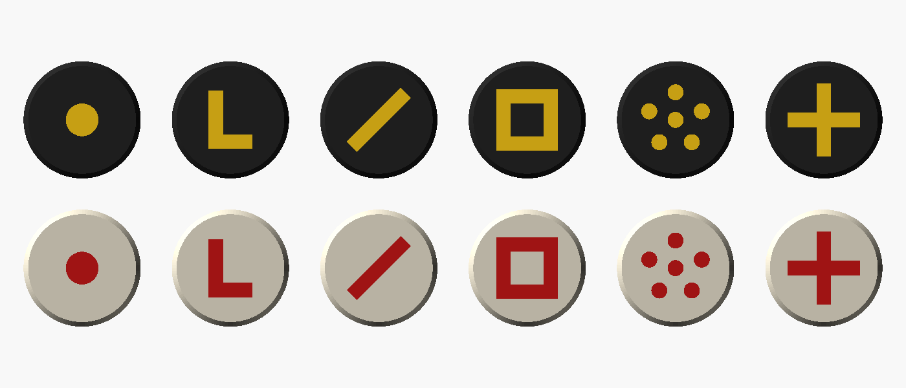

# Chess coins for the Prusa Core One + MMU3

Flat 15 mm coins, 4 mm thick, sized for a board with squares just under
20 mm. Each symbol is inlaid flush into the top in a second colour, so the
camera sees a clean mark with no shadows.

| Piece | Symbol | Per side |
|---|---|---|
| King | cross | 1 |
| Queen | crown of dots | 1 |
| Rook | square | 2 |
| Bishop | diagonal slash | 2 |
| Knight | L | 2 |
| Pawn | dot | 8 |

## Load the MMU like this

| Slot | Filament |
|---|---|
| 1 | white or cream (white coins) |
| 2 | red (white coins' symbols) |
| 3 | black (black coins) |
| 4 | yellow (black coins' symbols) |

## Print

1. Open `chess-coins-white.3mf` in PrusaSlicer. Each coin already has its
   body on slot 1 and symbol on slot 2. Pick your Core One MMU printer and
   0.2 mm layers, slice, print.
2. Do the same with `chess-coins-black.3mf` (slots 3 and 4).

Printing each side separately means colour changes only happen on the top
5 layers, so there is very little purge waste. `chess-coins-full-set.3mf`
prints all 32 at once, but it changes colour on every layer and wastes a lot
more filament.

No supports needed. Use a smooth sheet if you want the bottoms shiny, or a
textured sheet so the coins don't slide on the board.

## Other sizes

Change `square` in `coins.scad`, export each piece's `body` and `inlay`
into `stl/`, then run `python3 build_3mf.py` to rebuild the project files.
