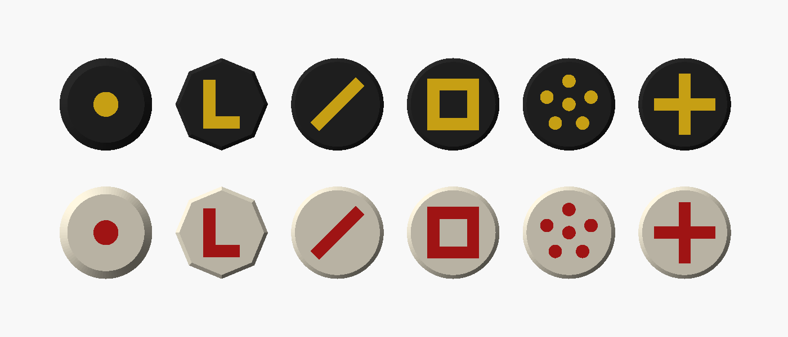
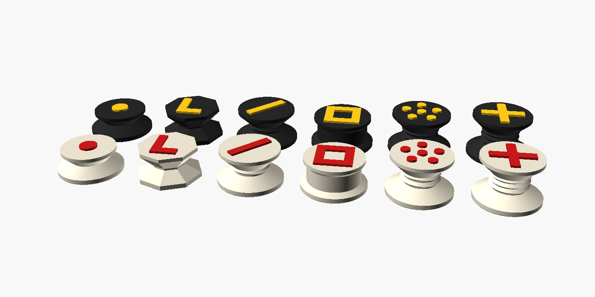

# Printable chess pieces

Low, wide pieces with a flat top and a raised symbol. From above, the camera
sees a big disc in the piece's colour with a clear mark on it. They're short
(14 to 25 mm) so they don't lean into neighbouring squares in the camera
image, and they print upright with no supports.

| Piece | Symbol on top | Side shape | Height | Print per side |
|---|---|---|---|---|
| Pawn | dot | small, plain | 14 mm | 8 |
| Knight | L | octagonal | 18 mm | 2 |
| Bishop | diagonal slash | one ring | 20 mm | 2 |
| Rook | square | straight tower | 18 mm | 2 |
| Queen | crown of dots | two rings | 23 mm | 1 |
| King | cross | three rings | 25 mm | 1 |

Sizes in `stl/` are for a board with **50 mm squares** (bases are 36 mm
across). For a different board, change `square` at the top of `pieces.scad`
and export again from OpenSCAD.

## Files

- `stl/<piece>.stl`: the whole piece, symbol included.
- `stl/<piece>_body.stl` and `stl/<piece>_symbol.stl`: the same piece split
  in two, for multi-colour printers (AMS, MMU). Load both together as one
  object and give each part its own filament.
- `pieces.scad`: the editable OpenSCAD design.

## Colours

Pick colours that stand out from **both** kinds of square on your board.
For example:

- White side: cream body, red symbols.
- Black side: black body, yellow symbols.

Plain white pieces on light squares are the hardest thing for the camera to
see.

## Printing

- Print upright, no supports, 0.2 mm layers, 3 walls, 15% infill.
- **Single-colour printer:** use `stl/<piece>.stl` and add a filament change
  (pause) at the height in the table above. Everything above that height is
  the symbol. You can also print in one colour and paint the raised symbol.
- **Heavier pieces (optional):** set `recess_d = 20` in `pieces.scad` to
  leave a pocket under the base for a glued-in coin or steel washer, then
  add felt pads.
